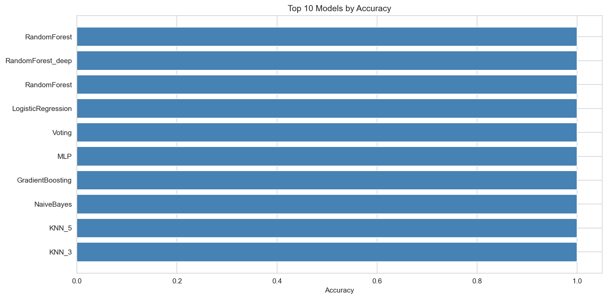
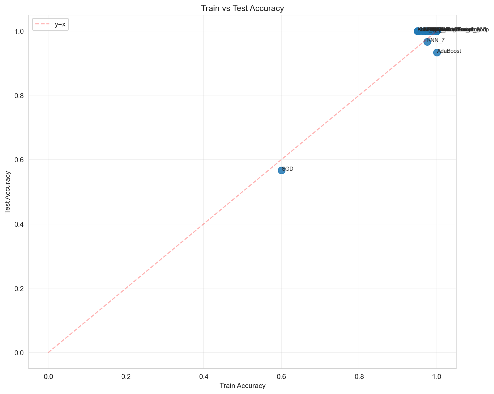
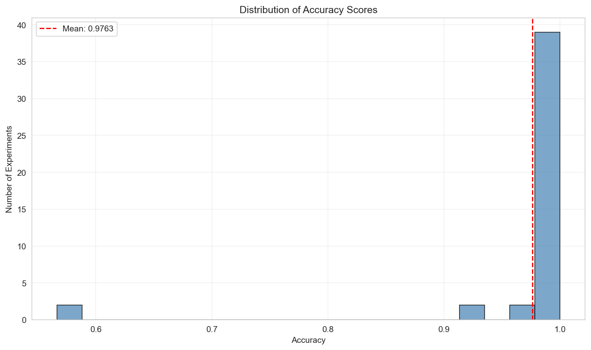

# Experiment Report

**Generated:** 2026-01-12 03:12:07
**Experiment:** iris-classification
**Total Experiments:** 45

## Summary

- **Total Runs:** 45
- **Best Accuracy:** 1.0000
- **Average Accuracy:** 0.9763
- **Min Accuracy:** 0.5667
- **Std Deviation:** 0.0906

## Visualizations

### Accuracy Comparison



### Train vs Test Accuracy



### Accuracy Distribution



## Comparison Table

| Rank | Algorithm | Accuracy | Train Accuracy | Status |
|------|-----------|----------|----------------|--------|
| 1 | RandomForest | 1.0000 | 1.0000 | FINISHED |
| 2 | RandomForest | 1.0000 | 1.0000 | FINISHED |
| 3 | KNN | 1.0000 | 0.9667 | FINISHED |
| 4 | LogisticRegression | 1.0000 | 0.9750 | FINISHED |
| 5 | SVM | 1.0000 | 0.9750 | FINISHED |
| 6 | RandomForest | 1.0000 | 1.0000 | FINISHED |
| 7 | RandomForest | 1.0000 | 1.0000 | FINISHED |
| 8 | SVM | 1.0000 | 0.9750 | FINISHED |
| 9 | RandomForest | 1.0000 | 1.0000 | FINISHED |
| 10 | Voting | 1.0000 | 0.9583 | FINISHED |
| 11 | MLP | 1.0000 | 0.9833 | FINISHED |
| 12 | GradientBoosting | 1.0000 | 1.0000 | FINISHED |
| 13 | NaiveBayes | 1.0000 | 0.9500 | FINISHED |
| 14 | KNN_5 | 1.0000 | 0.9667 | FINISHED |
| 15 | KNN_3 | 1.0000 | 0.9500 | FINISHED |
| 16 | SVM_poly | 1.0000 | 0.9833 | FINISHED |
| 17 | SVM_rbf | 1.0000 | 0.9750 | FINISHED |
| 18 | SVM_linear | 1.0000 | 0.9750 | FINISHED |
| 19 | DecisionTree_pruned | 1.0000 | 0.9917 | FINISHED |
| 20 | DecisionTree | 1.0000 | 1.0000 | FINISHED |


## Detailed Results


### 1. RandomForest

- **Accuracy:** 1.0000
- **Train Accuracy:** 1.0000
- **Status:** FINISHED
- **Run ID:** `ada88118`

**Parameters:**
```yaml
{
  "test_size": "0.2",
  "random_state": "42",
  "cv_folds": "5",
  "_target_": "sklearn.ensemble.RandomForestClassifier",
  "n_estimators": "100",
  "max_depth": "None",
  "min_samples_split": "2",
  "min_samples_leaf": "1",
  "algorithm": "RandomForest"
}
```


### 2. RandomForest

- **Accuracy:** 1.0000
- **Train Accuracy:** 1.0000
- **Status:** FINISHED
- **Run ID:** `94336cd1`

**Parameters:**
```yaml
{
  "test_size": "0.2",
  "random_state": "42",
  "cv_folds": "5",
  "_target_": "sklearn.ensemble.RandomForestClassifier",
  "n_estimators": "100",
  "max_depth": "None",
  "min_samples_split": "2",
  "min_samples_leaf": "1",
  "algorithm": "RandomForest"
}
```


### 3. KNN

- **Accuracy:** 1.0000
- **Train Accuracy:** 0.9667
- **Status:** FINISHED
- **Run ID:** `55e132eb`

**Parameters:**
```yaml
{
  "test_size": "0.2",
  "random_state": "42",
  "cv_folds": "5",
  "_target_": "sklearn.neighbors.KNeighborsClassifier",
  "n_neighbors": "5",
  "weights": "uniform",
  "algorithm": "KNN"
}
```


### 4. LogisticRegression

- **Accuracy:** 1.0000
- **Train Accuracy:** 0.9750
- **Status:** FINISHED
- **Run ID:** `ffec1fa5`

**Parameters:**
```yaml
{
  "test_size": "0.2",
  "random_state": "42",
  "cv_folds": "5",
  "_target_": "sklearn.linear_model.LogisticRegression",
  "max_iter": "1000",
  "solver": "lbfgs",
  "algorithm": "LogisticRegression"
}
```


### 5. SVM

- **Accuracy:** 1.0000
- **Train Accuracy:** 0.9750
- **Status:** FINISHED
- **Run ID:** `64348b31`

**Parameters:**
```yaml
{
  "test_size": "0.2",
  "random_state": "42",
  "cv_folds": "5",
  "_target_": "sklearn.svm.SVC",
  "kernel": "rbf",
  "C": "1.0",
  "gamma": "scale",
  "probability": "True",
  "algorithm": "SVM"
}
```


### 6. RandomForest

- **Accuracy:** 1.0000
- **Train Accuracy:** 1.0000
- **Status:** FINISHED
- **Run ID:** `a37b2752`

**Parameters:**
```yaml
{
  "test_size": "0.2",
  "random_state": "42",
  "cv_folds": "5",
  "_target_": "sklearn.ensemble.RandomForestClassifier",
  "n_estimators": "100",
  "max_depth": "None",
  "min_samples_split": "2",
  "min_samples_leaf": "1",
  "algorithm": "RandomForest"
}
```


### 7. RandomForest

- **Accuracy:** 1.0000
- **Train Accuracy:** 1.0000
- **Status:** FINISHED
- **Run ID:** `1a1b0c0d`

**Parameters:**
```yaml
{
  "test_size": "0.2",
  "random_state": "42",
  "cv_folds": "5",
  "_target_": "sklearn.ensemble.RandomForestClassifier",
  "n_estimators": "100",
  "max_depth": "None",
  "min_samples_split": "2",
  "min_samples_leaf": "1",
  "algorithm": "RandomForest"
}
```


### 8. SVM

- **Accuracy:** 1.0000
- **Train Accuracy:** 0.9750
- **Status:** FINISHED
- **Run ID:** `2e22b41b`

**Parameters:**
```yaml
{
  "test_size": "0.2",
  "random_state": "42",
  "cv_folds": "5",
  "_target_": "sklearn.svm.SVC",
  "kernel": "rbf",
  "C": "1.0",
  "gamma": "scale",
  "probability": "True",
  "algorithm": "SVM"
}
```


### 9. RandomForest

- **Accuracy:** 1.0000
- **Train Accuracy:** 1.0000
- **Status:** FINISHED
- **Run ID:** `28bc4085`

**Parameters:**
```yaml
{
  "test_size": "0.2",
  "random_state": "42",
  "cv_folds": "5",
  "_target_": "sklearn.ensemble.RandomForestClassifier",
  "n_estimators": "100",
  "max_depth": "None",
  "min_samples_split": "2",
  "min_samples_leaf": "1",
  "algorithm": "RandomForest"
}
```


### 10. Voting

- **Accuracy:** 1.0000
- **Train Accuracy:** 0.9583
- **Status:** FINISHED
- **Run ID:** `46c530d9`

**Parameters:**
```yaml
{
  "algorithm": "Voting",
  "voting": "soft",
  "n_estimators_rf": "50",
  "n_samples": "120",
  "n_features": "4"
}
```
