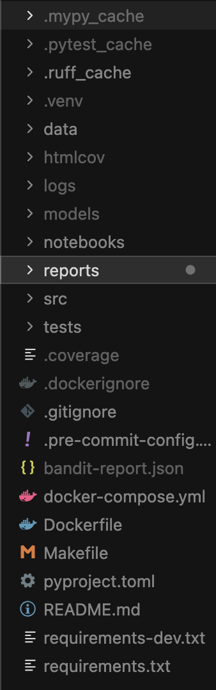
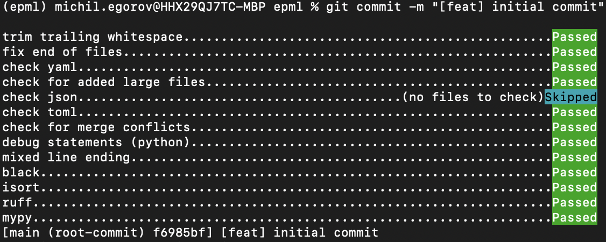
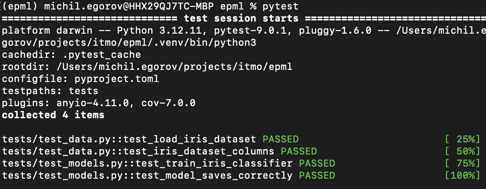
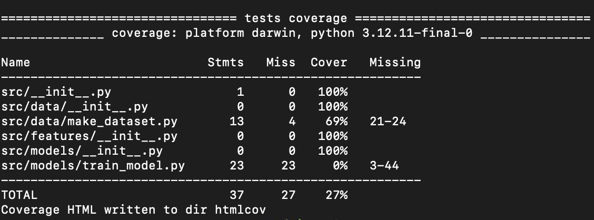
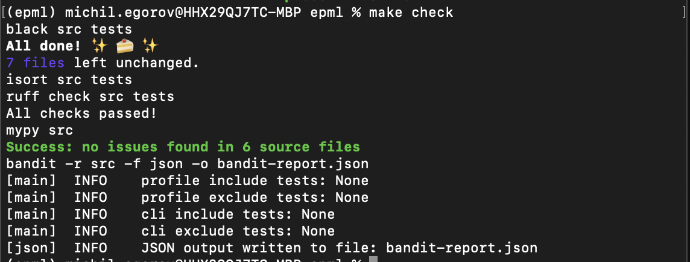

# Отчет о настройке рабочего места Data Scientist

**Курс:** EPML (Engineering Practices for Machine Learning)
**Задание:** ДЗ 1 - Настройка рабочего места Data Scientist
**Версия Python:** 3.12

## Структура проекта

Проект организован по стандартам Cookiecutter Data Science:

```
epml/
├── src/              # Исходный код
├── tests/            # Тесты
├── notebooks/        # Jupyter ноутбуки
├── data/             # Данные (raw, processed, external)
├── models/           # Сохраненные модели
├── reports/          # Отчеты и визуализации
└── logs/             # Логи
```

**Скриншот структуры проекта:**


## Качество кода

### Pre-commit hooks

Настроены автоматические проверки перед коммитом:
- Форматирование (Black, isort)
- Линтинг (Ruff)
- Проверка типов (MyPy)

**Команда установки:**
```bash
pre-commit install
```

**Скриншот работы pre-commit:**


## Управление зависимостями

### UV

Проект использует `uv` для управления зависимостями.

## Docker

### Dockerfile

Используется Python 3.12-slim образ.

## Тестирование

**Скриншот запуска тестов:**


**Скриншот покрытия кода:**


## Makefile

**Скриншот выполнения make check:**


## Команды для воспроизведения

```bash
# Установка зависимостей
uv venv --python 3.12
source .venv/bin/activate
uv pip install -e ".[dev]"

# Настройка pre-commit
pre-commit install

# Проверки
make check
make test

# Docker
make docker-build
make docker-up
```
