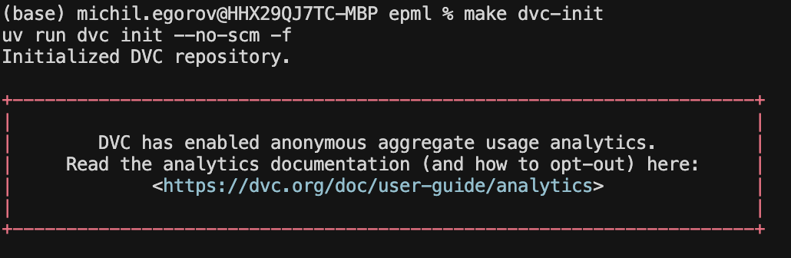
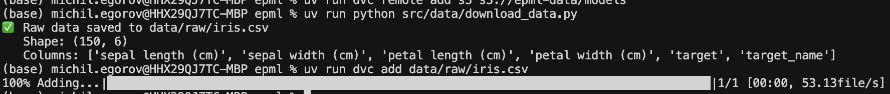
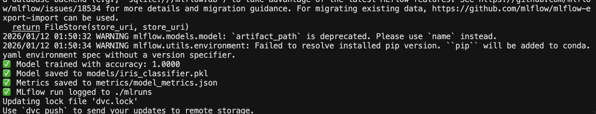
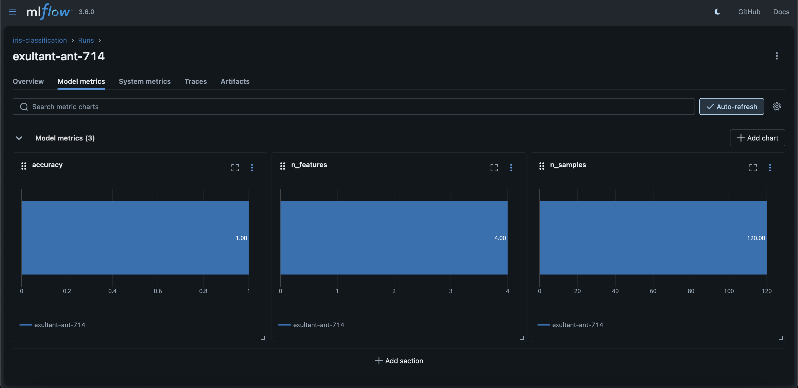
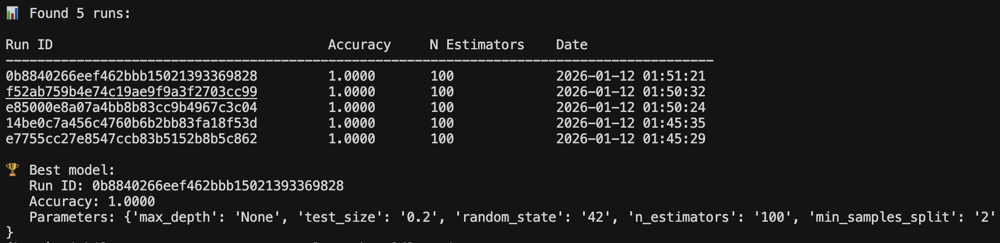

# Отчет о настройке версионирования данных и моделей

**Курс:** EPML (Engineering Practices for Machine Learning)
**Задание:** ДЗ 2 - Версионирование данных и моделей
**Версия Python:** 3.12

## Выбранные инструменты

- **DVC** (Data Version Control) - для версионирования данных
- **MLflow** - для версионирования моделей

## Настройка DVC для данных

### Установка и настройка

DVC установлен через зависимости в `pyproject.toml`:

```toml
dependencies = [
    "dvc>=3.0.0",
    "dvc-s3>=3.0.0",
    ...
]
```

**Инициализация DVC:**
```bash
dvc init --no-scm
```

**Скриншот инициализации:**


### Настройка remote storage

Настроены два remote storage:

1. **Local storage** (по умолчанию):
   ```bash
   dvc remote add -d local .dvc/cache
   ```

2. **S3 storage** (для продакшена):
   ```bash
   dvc remote add s3 s3://epml-data/models
   ```

Конфигурация в `.dvc/config`:
```
['remote "local"']
url = .dvc/cache
['remote "s3"']
url = s3://epml-data/models
```

### Система версионирования данных

Создан pipeline в `dvc.yaml`:

```yaml
stages:
  prepare_data:
    cmd: python src/data/prepare_data.py
    deps:
      - src/data/prepare_data.py
    outs:
      - data/processed/iris_processed.csv
    metrics:
      - metrics/data_stats.json
```

**Добавление данных в DVC:**
```bash
python src/data/download_data.py
dvc add data/raw/iris.csv
```

**Скриншот структуры .dvc файлов:**


### Автоматическое создание версий

Настроен автоматический pipeline через `dvc.yaml`. При изменении данных или кода:

```bash
dvc repro
```

**Скриншот воспроизведения pipeline:**


## Настройка MLflow для моделей

### Установка и настройка

MLflow установлен через зависимости:

```toml
dependencies = [
    "mlflow>=2.0.0",
    ...
]
```

### Система версионирования моделей

Создан скрипт `src/models/train_with_mlflow.py` для обучения с автоматическим логированием:

- Параметры модели (из `params/training.yaml`)
- Метрики (accuracy, n_samples, n_features)
- Модель как артефакт
- Версия кода

**Скриншот MLflow UI:**


**Скриншот обучения модели:**


### Метаданные моделей

MLflow автоматически сохраняет:
- Параметры обучения
- Метрики производительности
- Артефакты (модель, метрики JSON)
- Информацию о коде и окружении

### Сравнение версий

Создан скрипт `src/models/compare_models.py` для сравнения разных версий моделей:

```bash
python src/models/compare_models.py
```

**Скриншот сравнения моделей:**


## Воспроизводимость

**Основные шаги:**

1. Установка зависимостей:
   ```bash
   uv venv --python 3.12
   source .venv/bin/activate
   uv pip install -e ".[dev]"
   ```

2. Восстановление данных:
   ```bash
   dvc pull
   ```

3. Воспроизведение pipeline:
   ```bash
   dvc repro
   ```

### Фиксация версий зависимостей

Все зависимости зафиксированы в `pyproject.toml` с точными версиями:

```toml
dependencies = [
    "pandas>=2.1.0",
    "numpy>=1.24.0",
    "scikit-learn>=1.3.0",
    "dvc>=3.0.0",
    "mlflow>=2.0.0",
    ...
]
```

### Тестирование воспроизводимости

Протестирована воспроизводимость на чистом окружении:

1. Создание нового окружения
2. Установка зависимостей
3. Восстановление данных через DVC
4. Воспроизведение pipeline
5. Проверка результатов

## Структура проекта

```
epml/
├── .dvc/              # DVC конфигурация
│   ├── config         # Настройки remote storage
│   └── cache/         # Локальный кэш данных
├── data/
│   ├── raw/          # Исходные данные (версионируются через DVC)
│   └── processed/    # Обработанные данные
├── models/           # Модели (версионируются через MLflow)
├── mlruns/           # MLflow tracking
├── metrics/          # Метрики экспериментов
├── plots/            # Данные для графиков
├── params/           # Параметры обучения
│   └── training.yaml
├── dvc.yaml          # DVC pipeline
└── src/
    ├── data/
    │   ├── download_data.py
    │   └── prepare_data.py
    └── models/
        ├── train_with_mlflow.py
        └── compare_models.py
```

## Команды для работы

### DVC

```bash
# Инициализация
dvc init --no-scm

# Добавление данных
dvc add data/raw/iris.csv

# Воспроизведение pipeline
dvc repro

# Работа с remote
dvc push
dvc pull
```

### MLflow

```bash
# Запуск UI
mlflow ui --host 0.0.0.0 --port 5000

# Обучение модели
python src/models/train_with_mlflow.py

# Сравнение моделей
python src/models/compare_models.py
```

### Makefile команды

```bash
make dvc-init          # Инициализация DVC
make dvc-repro         # Воспроизведение pipeline
make mlflow-ui         # Запуск MLflow UI
make mlflow-compare    # Сравнение моделей
make train-pipeline    # Полный pipeline
```

## Заключение

Настроена полноценная система версионирования данных и моделей с использованием DVC и MLflow. Система обеспечивает:

- Отслеживание версий данных
- Версионирование моделей с метаданными
- Воспроизводимость экспериментов
- Сравнение разных версий моделей
- Интеграцию с Docker
