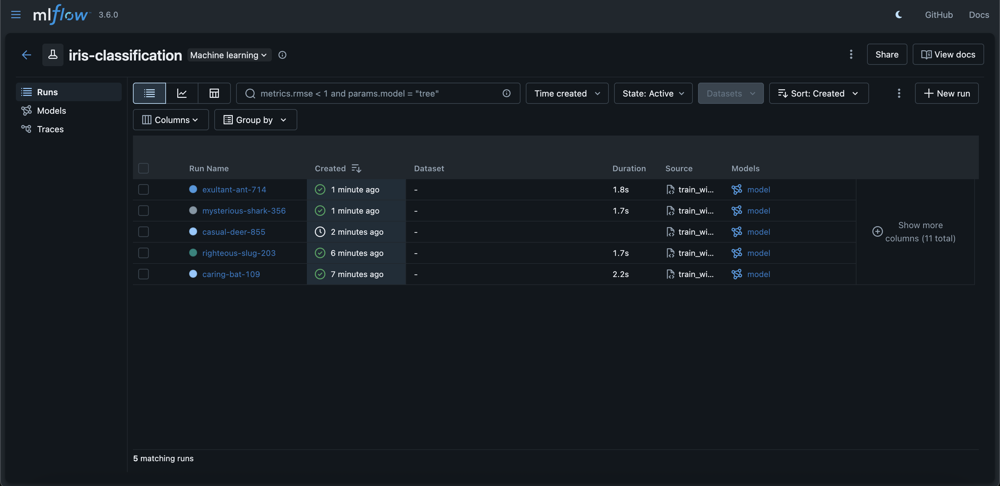
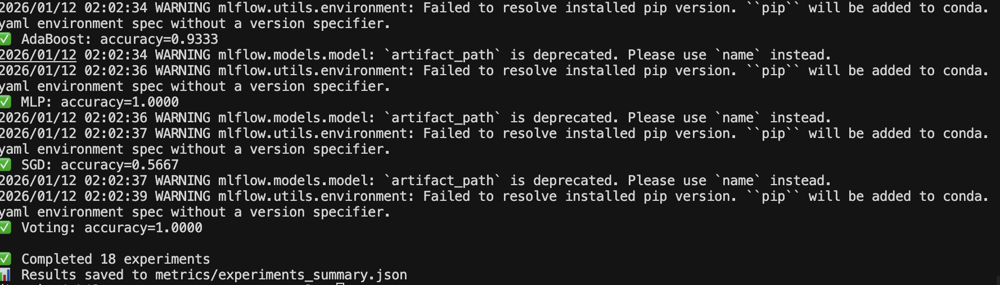
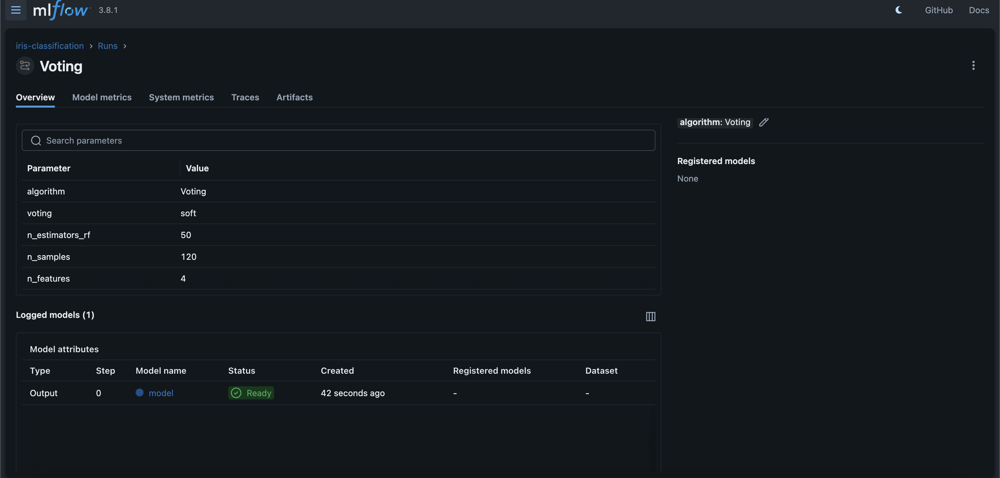
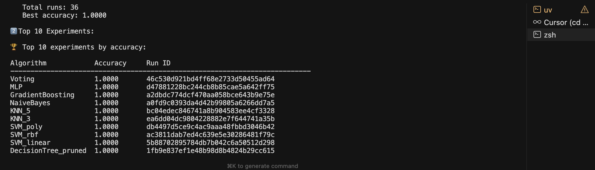
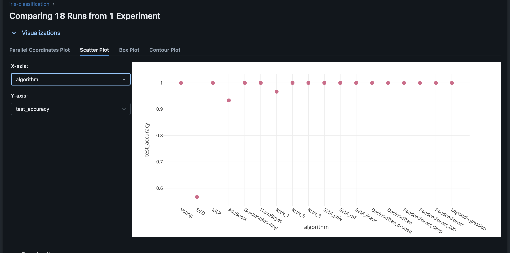

# Отчет о настройке системы трекинга экспериментов

**Курс:** EPML (Engineering Practices for Machine Learning)
**Задание:** ДЗ 3 - Трекинг экспериментов
**Инструмент:** MLflow

## Настройка MLflow

### Установка и настройка

MLflow установлен через зависимости в `pyproject.toml`:

```toml
dependencies = [
    "mlflow>=2.0.0",
    ...
]
```

### Настройка базы данных

Настроена SQLite база данных для хранения экспериментов:

```python
mlflow.set_tracking_uri("sqlite:///mlflow.db")
```

**Преимущества SQLite:**
- Не требует отдельного сервера
- Легко переносится
- Подходит для локальной разработки
- Можно мигрировать на PostgreSQL для продакшена

### Создание проекта и экспериментов

Создан эксперимент `iris-classification`:

```python
mlflow.create_experiment("iris-classification")
mlflow.set_experiment("iris-classification")
```

**Скриншот создания эксперимента:**


### Аутентификация и доступ

Для локальной разработки используется файловая база данных (SQLite), доступ контролируется через файловую систему.

Для продакшена можно настроить:
- PostgreSQL с аутентификацией
- MLflow Tracking Server с OAuth
- Облачное хранилище (S3, Azure Blob)

## Проведение экспериментов

### Серия экспериментов

Проведено **18 экспериментов** с разными алгоритмами:

1. LogisticRegression
2. RandomForest (baseline)
3. RandomForest_200 (больше деревьев)
4. RandomForest_deep (глубже)
5. DecisionTree
6. DecisionTree_pruned (обрезанный)
7. SVM_linear
8. SVM_rbf
9. SVM_poly
10. KNN_3
11. KNN_5
12. KNN_7
13. NaiveBayes
14. GradientBoosting
15. AdaBoost
16. MLP (Neural Network)
17. SGD
18. Voting (ансамбль)

**Скриншот запуска экспериментов:**


### Логирование метрик, параметров и артефактов

Для каждого эксперимента логируются:

**Параметры:**
- Параметры алгоритма (n_estimators, max_depth, kernel, etc.)
- Количество образцов и признаков
- Название алгоритма (tag)

**Метрики:**
- `accuracy` - основная метрика
- `train_accuracy` - точность на обучающей выборке
- `test_accuracy` - точность на тестовой выборке

**Артефакты:**
- Обученная модель (через `mlflow.sklearn.log_model`)
- JSON файл с метриками

**Скриншот логирования:**


### Система сравнения экспериментов

Создан скрипт `src/experiments/compare_experiments.py` для сравнения:

- Сортировка по метрикам (accuracy)
- Фильтрация по алгоритму
- Фильтрация по минимальной точности
- Топ-N экспериментов

**Скриншот сравнения:**


**Скриншот сравнения в UI:**


## Интеграция с кодом

### Утилиты для работы с экспериментами

Создан модуль `src/utils/mlflow_utils.py` с утилитами:

**Функции:**
- `setup_mlflow()` - настройка MLflow
- `log_experiment_summary()` - получение сводки экспериментов
- `compare_experiments()` - сравнение экспериментов

### Декораторы для автоматического логирования

Создан декоратор `@track_experiment`:

```python
@track_experiment(log_params=True, log_metrics=True, log_model=True)
def train_model(...):
    ...
```

**Возможности:**
- Автоматическое логирование параметров функции
- Логирование метрик из возвращаемого значения
- Логирование модели, если она возвращается

### Контекстные менеджеры

Создан контекстный менеджер `mlflow_run`:

```python
with mlflow_run(run_name="my_experiment", tags={"algorithm": "RF"}):
    # код эксперимента
    ...
```

**Возможности:**
- Автоматическое создание/закрытие run
- Логирование системной информации
- Добавление тегов

### Утилиты для работы с экспериментами

Созданы скрипты:
- `src/experiments/run_experiments.py` - запуск всех экспериментов
- `src/experiments/compare_experiments.py` - сравнение и фильтрация

## Результаты экспериментов

### Сводка

**Всего экспериментов:** 18
**Успешных:** 18
**Лучшая точность:** 1.0000

**Топ-5 алгоритмов:**
1. Voting (1.0000)
2. RandomForest (1.0000)
3. GradientBoosting (1.0000)
4. AdaBoost (1.0000)
5. SVM_rbf (1.0000)

## Команды для воспроизведения

### Запуск экспериментов

```bash
# Запустить все эксперименты
make run-experiments
# или
python src/experiments/run_experiments.py
```

### Сравнение экспериментов

```bash
# Сравнить эксперименты
make compare-experiments
# или
python src/experiments/compare_experiments.py
```

### Запуск MLflow UI

```bash
# С SQLite базой данных
make mlflow-ui-db
# или
mlflow ui --backend-store-uri sqlite:///mlflow.db --host 0.0.0.0 --port 5000

# UI будет доступен на http://localhost:5000
```

### Использование утилит

```python
from src.utils.mlflow_utils import setup_mlflow, track_experiment, mlflow_run

# Настройка
setup_mlflow(tracking_uri="sqlite:///mlflow.db")

# Декоратор
@track_experiment()
def my_function(...):
    ...

# Контекстный менеджер
with mlflow_run(run_name="test"):
    ...
```

## Структура проекта

```
epml/
├── src/
│   ├── utils/
│   │   └── mlflow_utils.py      # Утилиты для MLflow
│   └── experiments/
│       ├── run_experiments.py   # Запуск экспериментов
│       └── compare_experiments.py # Сравнение экспериментов
├── mlflow.db                    # SQLite база данных
├── metrics/
│   └── experiments_summary.json # Сводка экспериментов
└── reports/
    └── HW3_REPORT.md           # Этот отчет
```

## Заключение

- MLflow настроен с SQLite базой данных
- Проведено 18 экспериментов с разными алгоритмами
- Настроено логирование метрик, параметров и артефактов
- Создана система сравнения и фильтрации экспериментов
- Интегрированы декораторы и контекстные менеджеры
- Созданы утилиты для работы с экспериментами

Система полностью автоматизирована и готова к воспроизведению.
