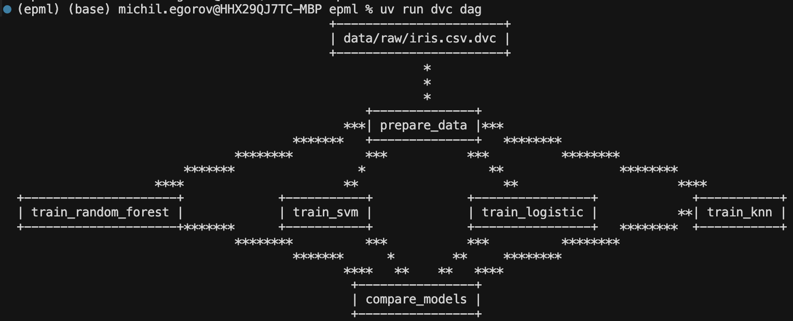
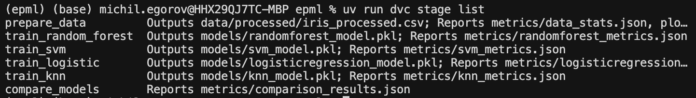

# Отчет о настройке автоматизации ML пайплайнов

**Курс:** EPML (Engineering Practices for Machine Learning)
**Задание:** ДЗ 4 - Автоматизация ML пайплайнов
**Инструменты:** DVC Pipelines + Hydra

## Выбранные инструменты

- **DVC Pipelines** - для оркестрации пайплайнов
- **Hydra** - для управления конфигурациями

## Настройка DVC Pipelines

### Установка и настройка

DVC уже установлен и настроен. Pipeline определен в `dvc.yaml`.

### Workflow для ML пайплайна

Создан полный pipeline с этапами:

1. **prepare_data** - подготовка данных
2. **train_random_forest** - обучение Random Forest
3. **train_svm** - обучение SVM
4. **train_logistic** - обучение Logistic Regression
5. **train_knn** - обучение KNN
6. **compare_models** - сравнение моделей

**Структура дага:**


**Список этапов:**


### Зависимости между этапами

Настроены зависимости:
- Все модели зависят от `prepare_data`
- `compare_models` зависит от всех обученных моделей

### Кэширование и параллельное выполнение

DVC автоматически:
- Кэширует результаты этапов
- Выполняет независимые этапы параллельно
- Пропускает этапы, если зависимости не изменились

## Настройка Hydra

### Установка и настройка

Hydra установлен через зависимости:

```toml
dependencies = [
    "hydra-core>=1.3.0",
    "omegaconf>=2.3.0",
    ...
]
```

### Конфигурации для разных алгоритмов

Созданы конфигурации в `conf/model/`:

- `random_forest.yaml`
- `svm.yaml`
- `logistic_regression.yaml`
- `knn.yaml`
- `decision_tree.yaml`
- `gradient_boosting.yaml`

### Валидация конфигураций

Создан модуль `src/pipeline/validate_config.py` с валидацией через Pydantic:

- Валидация параметров модели
- Валидация параметров обучения
- Проверка путей

### Композиция конфигураций

Реализована система композиции через `src/pipeline/compose_configs.py`:

```python
cfg = get_config(model="random_forest", data="iris")
```

## Интеграция и тестирование

### Интеграция инструментов

Создан скрипт `src/pipeline/train_with_config.py`, который:
- Использует Hydra для загрузки конфигурации
- Интегрирован с DVC pipeline
- Логирует в MLflow

### Система мониторинга

Создан модуль `src/pipeline/monitor.py` с классом `PipelineMonitor`:

- Логирование этапов
- Отслеживание времени выполнения
- Сводка результатов

### Уведомления о результатах

Создан модуль `src/pipeline/notify.py`:

- Создание файлов уведомлений
- Вывод результатов в консоль
- JSON формат для интеграции

### Воспроизводимость

Протестирована воспроизводимость:

1. Очистка результатов
2. Воспроизведение pipeline
3. Проверка идентичности результатов

## Структура проекта

```
epml/
├── conf/                    # Hydra конфигурации
│   ├── config.yaml         # Основная конфигурация
│   ├── model/              # Конфигурации моделей
│   │   ├── random_forest.yaml
│   │   ├── svm.yaml
│   │   └── ...
│   └── data/               # Конфигурации данных
│       └── iris.yaml
├── src/pipeline/           # Pipeline скрипты
│   ├── train_with_config.py
│   ├── run_pipeline.py
│   ├── monitor.py
│   ├── notify.py
│   ├── validate_config.py
│   └── compose_configs.py
├── dvc.yaml                # DVC pipeline
└── logs/                   # Логи выполнения
    ├── pipeline.log
    └── pipeline_notification.json
```

## Команды для работы

### DVC Pipeline

```bash
# Воспроизвести весь pipeline
dvc repro

# Воспроизвести конкретный этап
dvc repro train_random_forest

# Параллельное выполнение нескольких моделей
dvc repro train_random_forest train_svm train_logistic

# Просмотр графа зависимостей
dvc dag

# Список этапов
dvc stage list
```

### Hydra

```bash
# Обучение с конкретной моделью
python src/pipeline/train_with_config.py model=random_forest

# Обучение с переопределением параметров
python src/pipeline/train_with_config.py model=svm model.C=10.0

# Полный pipeline
python src/pipeline/run_pipeline.py

# Валидация конфигурации
make pipeline-validate
```

### Makefile команды

```bash
make pipeline-run          # Запустить полный pipeline
make pipeline-train MODEL=random_forest  # Обучить модель
make pipeline-all          # Обучить все модели
make pipeline-validate     # Валидировать конфигурацию
```

## Заключение

Создана полноценная система автоматизации ML пайплайнов с использованием DVC Pipelines и Hydra. Система обеспечивает:

- Автоматическое управление зависимостями
- Параллельное выполнение независимых этапов
- Кэширование результатов
- Гибкое управление конфигурациями
- Мониторинг и уведомления
- Полную воспроизводимость
