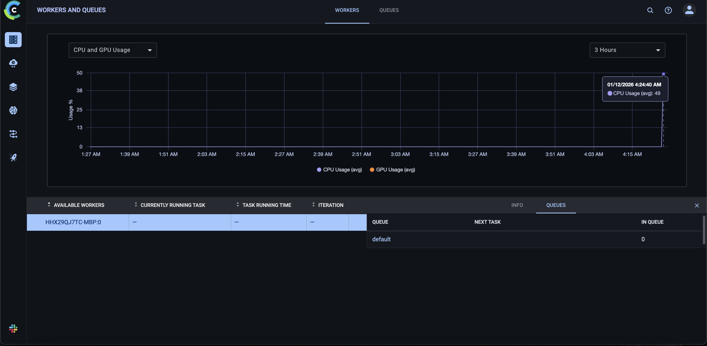

# Отчет о настройке ClearML для MLOps

**Курс:** EPML (Engineering Practices for Machine Learning)
**Задание:** ДЗ 5 - ClearML для MLOps
**Инструмент:** ClearML

## Настройка ClearML

### Установка и настройка

ClearML установлен через зависимости:

```toml
dependencies = [
    "clearml>=1.15.0",
    ...
]
```

**Скриншот установки:**


### Запуск ClearML Server через Docker Compose

ClearML Server запускается через Docker Compose для удобства разработки.

**Файл конфигурации:** `docker-compose.clearml.yml`

**Запуск сервисов:**

```bash
# Запустить все сервисы
make clearml-up

# Или напрямую
docker-compose -f docker-compose.clearml.yml up -d
```

**Остановка сервисов:**

```bash
make clearml-down
# Или
docker-compose -f docker-compose.clearml.yml down
```

**Проверка статуса:**

```bash
make clearml-status
# Или
docker-compose -f docker-compose.clearml.yml ps
```

**Просмотр логов:**

```bash
make clearml-logs
# Или
docker-compose -f docker-compose.clearml.yml logs -f
```

**Сервисы:**
- **MongoDB** (порт 27017) - база данных
- **Redis** (порт 6379) - кэш и очереди
- **Elasticsearch** (порт 9200) - поиск и индексация
- **ClearML Server**:
  - API Server: `http://localhost:8008`
  - Web Server: `http://localhost:8080`
  - Files Server: `http://localhost:8081`

### Создание проекта и экспериментов

Создан модуль `src/clearml_utils/setup.py` для настройки проектов:

```python
task = setup_clearml(
    project_name="EPML",
    task_name="experiment_name",
    tags=["iris", "classification"],
)
```

### Аутентификация в UI ClearML

Для доступа к веб-интерфейсу ClearML (UI) требуется аутентификация.

**Первоначальная настройка:**

1. После запуска сервисов через `make clearml-up`, откройте браузер и перейдите на `http://localhost:8080`
2. **Логин по умолчанию:** `admin`
3. **Пароль по умолчанию:** `admin`

**Настройка API ключей:**

После создания учетной записи в UI:

1. Перейдите в **Settings** → **Workspace** → **Create new credentials**
2. Скопируйте **Access Key** и **Secret Key**
3. Настройте через переменные окружения:

```bash
export CLEARML_API_ACCESS_KEY="your_access_key"
export CLEARML_API_SECRET_KEY="your_secret_key"
```

Или через файл конфигурации `./clearml.conf`:

**Скриншот UI ClearML:**


## Трекинг экспериментов

### Автоматическое логирование

Создан модуль `src/clearml_utils/tracking.py` с функциями:

- `log_parameters()` - логирование параметров
- `log_metrics()` - логирование метрик
- `log_model()` - регистрация моделей
- `log_artifacts()` - логирование артефактов

### Система сравнения экспериментов

Создан модуль `src/clearml_utils/compare_experiments.py` для сравнения экспериментов:

```python
experiments = compare_experiments(
    project_name="EPML",
    metric="accuracy",
    top_n=10,
)
```

### Логирование метрик и параметров

Все метрики и параметры автоматически логируются в ClearML:

- Параметры модели (гиперпараметры)
- Метрики обучения (accuracy, train_accuracy)
- Модели и артефакты

**Скриншот метрик:**


### Дашборды для анализа

ClearML предоставляет веб-интерфейс для анализа экспериментов:

- Графики метрик
- Сравнение экспериментов
- Фильтрация и поиск

**Скриншот дашборда:**


## Управление моделями

### Регистрация и версионирование моделей

Создан модуль `src/clearml_utils/model_registry.py`:

```python
model = register_model(
    model_path="models/model.pkl",
    model_name="iris_classifier",
    project_name="EPML",
    tags=["production", "iris"],
    metadata={"accuracy": 0.95},
)
```

**Скриншот регистрации:**


### Система метаданных для моделей

Модели регистрируются с метаданными:

- Метрики производительности
- Параметры обучения
- Теги и категории
- Связь с экспериментами

### Система сравнения моделей

Создана функция для сравнения версий моделей:

```python
versions = compare_models(
    model_name="iris_classifier",
    project_name="EPML",
    metric="accuracy",
)
```

**Скриншот сравнения моделей:**


## Пайплайны

### ClearML пайплайны для ML workflow

Создан модуль `src/clearml_utils/pipeline.py`:

```python
pipeline = create_training_pipeline(
    pipeline_name="iris_training_pipeline",
    project_name="EPML",
)
```

Пайплайн включает этапы:
1. `prepare_data` - подготовка данных
2. `train_model` - обучение модели
3. `evaluate_model` - оценка модели

### Автоматический запуск пайплайнов

Пайплайны можно запускать автоматически через скрипт:

```bash
# Автоматический запуск с мониторингом
make clearml-pipeline-auto

# Или через Python
python scripts/run_clearml_pipeline_auto.py --monitor --wait
```

Или программно:

```python
pipeline_id = run_pipeline(
    pipeline=pipeline,
    queue_name="default",
)
```

**Скриншот запуска:**


### Настройка ClearML Agent

Для выполнения пайплайнов требуется запущенный ClearML Agent, который обрабатывает задачи из очередей.

**Установка агента:**

```bash
# Агент уже включен в зависимости проекта
pip install clearml-agent
```

**Инициализация агента:**

```bash
# Первоначальная настройка (один раз)
clearml-agent init
```

При инициализации потребуется указать:
- ClearML Server URL: `http://localhost:8008`
- API credentials (Access Key и Secret Key из UI)

**Запуск агента:**

```bash
# Запустить агента для очереди 'default'
make clearml-agent-start

# Или напрямую
clearml-agent daemon --queue default
```

**Остановка агента:**

```bash
# Остановить агента
make clearml-agent-stop

# Или найти процесс и остановить
pkill -f "clearml-agent"
```

**Проверка статуса агента:**

Агент можно проверить в UI ClearML:
- Перейти в **Settings** → **Workers**
- Должен отображаться активный воркер для очереди `default`

**Скриншот агента:**


### Система мониторинга выполнения

Создан модуль `src/clearml_utils/pipeline_monitor.py` для мониторинга пайплайнов через ClearML API:

```python
from src.clearml_utils.pipeline_monitor import ClearMLPipelineMonitor

monitor = ClearMLPipelineMonitor()
status = monitor.monitor_pipeline(
    pipeline_id=pipeline_id,
    check_interval=10,  # Проверка каждые 10 секунд через ClearML API
    timeout=3600,       # Таймаут 1 час
)
```

**Особенности мониторинга:**
- Использует ClearML API для получения статуса пайплайна и его шагов
- Прогресс логируется в ClearML task через `task.logger.report_text()`
- Статус шагов получается через `PipelineController.from_task_id()`
- Все данные доступны в ClearML UI, без локальных логов

**Мониторинг через командную строку:**

```bash
# Мониторинг конкретного пайплайна
make clearml-pipeline-monitor PIPELINE_ID=xxx
```

**Скриншот мониторинга:**


### Уведомления о результатах

Система автоматически отправляет уведомления в ClearML task:

```python
from src.clearml_utils.pipeline_monitor import send_notification

notification = send_notification(
    pipeline_id=pipeline_id,
    status="completed",
    summary=summary,
)
```

**Как работают уведомления:**
- Уведомления отправляются в ClearML task через `task.logger.report_text()`
- Добавляются в комментарий задачи через `task.set_comment()`
- Добавляются теги для фильтрации: `monitored_completed`, `monitored_failed`
- Все уведомления видны в ClearML UI в разделе "Log" и "Info" задачи

**Пример уведомления в ClearML:**

```
✅ Pipeline COMPLETED

Summary:
- Duration: 120.5s
- Steps: 3
- Status: completed

View at: http://localhost:8080/projects/EPML/experiments/xxx
```

Уведомления также можно сохранить локально (опционально) для резервного копирования.

## Структура проекта

```
epml/
├── src/clearml_utils/        # ClearML утилиты
│   ├── __init__.py
│   ├── setup.py              # Настройка ClearML
│   ├── tracking.py           # Трекинг экспериментов
│   ├── model_registry.py     # Регистрация моделей
│   ├── train_with_clearml.py # Обучение с ClearML
│   ├── run_experiments.py    # Запуск экспериментов
│   ├── compare_experiments.py # Сравнение экспериментов
│   ├── pipeline.py           # Пайплайны
│   └── pipeline_monitor.py   # Мониторинг пайплайнов
├── scripts/
│   ├── run_clearml_pipeline.py      # Запуск пайплайнов
│   └── run_clearml_pipeline_auto.py # Автоматический запуск
├── clearml.conf              # Конфигурация ClearML
├── docker-compose.clearml.yml # Docker Compose для ClearML Server
└── reports/
    └── HW5_REPORT.md         # Отчет
```

## Команды для работы

### Запуск ClearML Server

```bash
# Запустить все сервисы ClearML
make clearml-up

# Проверить статус сервисов
make clearml-status

# Просмотреть логи
make clearml-logs

# Остановить сервисы
make clearml-down
```

**Доступ к UI:**
- URL: `http://localhost:8080`
- Логин: `admin` (по умолчанию)
- Пароль: `admin` (по умолчанию, рекомендуется изменить при первом входе)

### Настройка

```bash
# Проверить конфигурацию
make clearml-setup

# Настроить переменные окружения (после получения ключей из UI)
export CLEARML_API_ACCESS_KEY="your_key"
export CLEARML_API_SECRET_KEY="your_secret"
```

### Эксперименты

```bash
# Запустить все эксперименты
make clearml-experiments

# Обучить одну модель
make clearml-train

# Сравнить эксперименты
make clearml-compare
```

### Пайплайны

```bash
# Создать и запустить пайплайн
make clearml-pipeline

# Автоматический запуск с мониторингом
make clearml-pipeline-auto

# Мониторинг существующего пайплайна
make clearml-pipeline-monitor PIPELINE_ID=xxx
```

Или программно:

```python
from src.clearml_utils.pipeline import create_training_pipeline, run_pipeline

pipeline = create_training_pipeline()
pipeline_id = run_pipeline(pipeline)
```

### ClearML Agent

```bash
# Запустить агента для обработки очередей
make clearml-agent-start

# Остановить агента
make clearml-agent-stop

# Проверить статус (через UI или логи)
```

## Заключение

Настроена комплексная система MLOps с использованием ClearML:

- Автоматический трекинг экспериментов
- Управление моделями с версионированием
- Пайплайны для автоматизации workflow
- Мониторинг и уведомления
- Веб-интерфейс для анализа

Система готова к использованию в продакшене.
