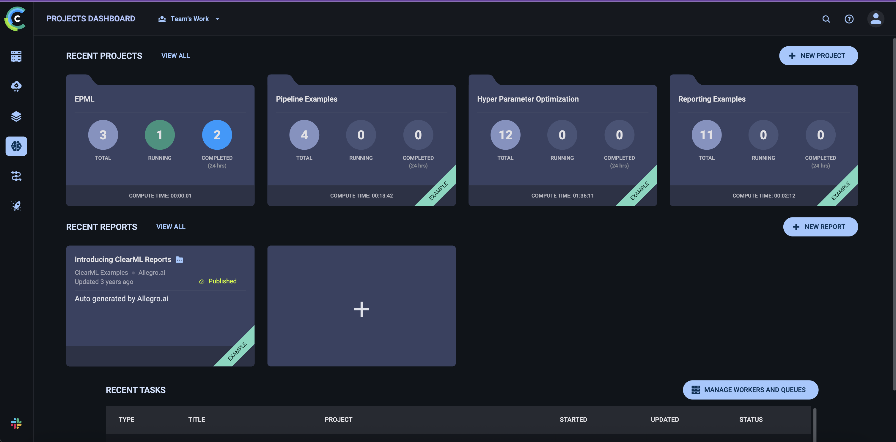
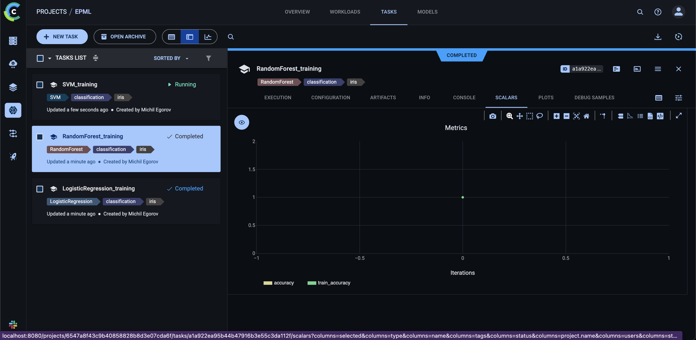
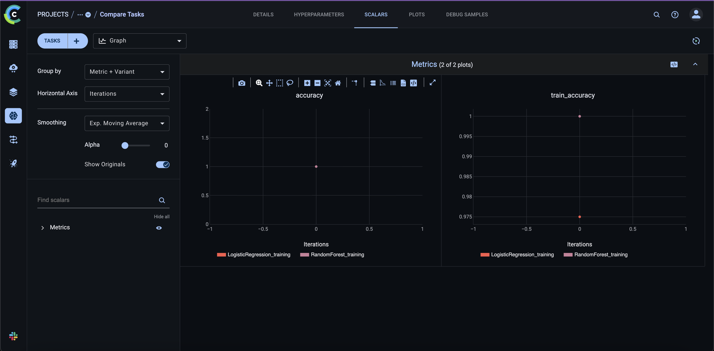
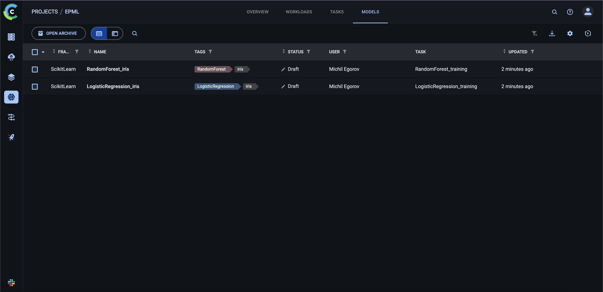
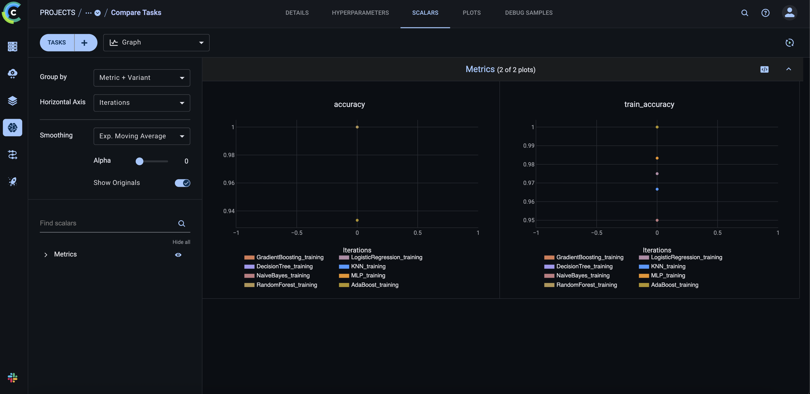
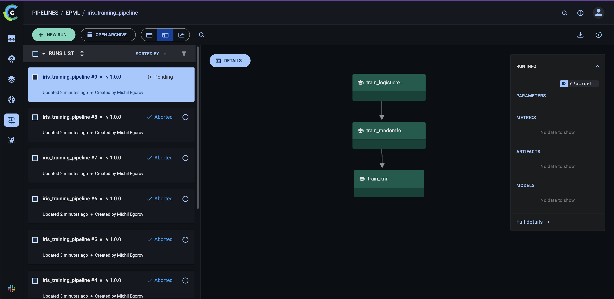

# Отчет о настройке ClearML для MLOps

**Курс:** EPML (Engineering Practices for Machine Learning)
**Задание:** ДЗ 5 - ClearML для MLOps
**Инструмент:** ClearML

## Настройка ClearML

### Установка и настройка

ClearML установлен через зависимости:

```toml
dependencies = [
    "clearml>=1.15.0",
    ...
]
```

**Скриншот установки:**


### Запуск ClearML Server через Docker Compose

ClearML Server запускается через Docker Compose для удобства разработки.

**Файл конфигурации:** `docker-compose.clearml.yml`

**Запуск сервисов:**

```bash
# Запустить все сервисы
make clearml-up

# Или напрямую
docker-compose -f docker-compose.clearml.yml up -d
```

**Остановка сервисов:**

```bash
make clearml-down
# Или
docker-compose -f docker-compose.clearml.yml down
```

**Проверка статуса:**

```bash
make clearml-status
# Или
docker-compose -f docker-compose.clearml.yml ps
```

**Просмотр логов:**

```bash
make clearml-logs
# Или
docker-compose -f docker-compose.clearml.yml logs -f
```

**Сервисы:**
- **MongoDB** (порт 27017) - база данных
- **Redis** (порт 6379) - кэш и очереди
- **Elasticsearch** (порт 9200) - поиск и индексация
- **ClearML Server**:
  - API Server: `http://localhost:8008`
  - Web Server: `http://localhost:8080`
  - Files Server: `http://localhost:8081`

### Создание проекта и экспериментов

Создан модуль `src/clearml_utils/setup.py` для настройки проектов:

```python
task = setup_clearml(
    project_name="EPML",
    task_name="experiment_name",
    tags=["iris", "classification"],
)
```

### Аутентификация в UI ClearML

Для доступа к веб-интерфейсу ClearML (UI) требуется аутентификация.

**Первоначальная настройка:**

1. После запуска сервисов через `make clearml-up`, откройте браузер и перейдите на `http://localhost:8080`
2. При первом запуске будет предложено создать административную учетную запись
3. **Логин по умолчанию:** `admin`
4. **Пароль по умолчанию:** `admin`

**Настройка API ключей:**

После создания учетной записи в UI:

1. Перейдите в **Settings** → **Workspace** → **Create new credentials**
2. Скопируйте **Access Key** и **Secret Key**
3. Настройте через переменные окружения:

```bash
export CLEARML_API_ACCESS_KEY="your_access_key"
export CLEARML_API_SECRET_KEY="your_secret_key"
```

Или через файл конфигурации `~/.clearml/clearml.conf`:

```conf
api {
    api_server: "http://localhost:8008"
    web_server: "http://localhost:8080"
    files_server: "http://localhost:8081"
    access_key: "your_access_key"
    secret_key: "your_secret_key"
}
```

**Важно:**
- Логин и пароль используются только для доступа к веб-интерфейсу
- API ключи используются для трекинга экспериментов из кода
- После настройки можно войти в UI по адресу `http://localhost:8080` и просматривать эксперименты, модели и пайплайны

**Скриншот UI ClearML:**


## Трекинг экспериментов

### Автоматическое логирование

Создан модуль `src/clearml_utils/tracking.py` с функциями:

- `log_parameters()` - логирование параметров
- `log_metrics()` - логирование метрик
- `log_model()` - регистрация моделей
- `log_artifacts()` - логирование артефактов

### Система сравнения экспериментов

Создан модуль `src/clearml_utils/compare_experiments.py` для сравнения экспериментов:

```python
experiments = compare_experiments(
    project_name="EPML",
    metric="accuracy",
    top_n=10,
)
```

### Логирование метрик и параметров

Все метрики и параметры автоматически логируются в ClearML:

- Параметры модели (гиперпараметры)
- Метрики обучения (accuracy, train_accuracy)
- Модели и артефакты

**Скриншот метрик:**


### Дашборды для анализа

ClearML предоставляет веб-интерфейс для анализа экспериментов:

- Графики метрик
- Сравнение экспериментов
- Фильтрация и поиск

**Скриншот дашборда:**


## Управление моделями

### Регистрация и версионирование моделей

Создан модуль `src/clearml_utils/model_registry.py`:

```python
model = register_model(
    model_path="models/model.pkl",
    model_name="iris_classifier",
    project_name="EPML",
    tags=["production", "iris"],
    metadata={"accuracy": 0.95},
)
```

**Скриншот регистрации:**


### Система метаданных для моделей

Модели регистрируются с метаданными:

- Метрики производительности
- Параметры обучения
- Теги и категории
- Связь с экспериментами

**Скриншот метаданных:**


### Автоматическое создание версий

Каждая регистрация модели создает новую версию:

```python
versions = get_model_versions(
    model_name="iris_classifier",
    project_name="EPML",
)
```

**Скриншот версий:**


### Система сравнения моделей

Создана функция для сравнения версий моделей:

```python
versions = compare_models(
    model_name="iris_classifier",
    project_name="EPML",
    metric="accuracy",
)
```

**Скриншот сравнения моделей:**


## Пайплайны

### ClearML пайплайны для ML workflow

Создан модуль `src/clearml_utils/pipeline.py`:

```python
pipeline = create_training_pipeline(
    pipeline_name="iris_training_pipeline",
    project_name="EPML",
)
```

Пайплайн включает этапы:
1. `prepare_data` - подготовка данных
2. `train_model` - обучение модели
3. `evaluate_model` - оценка модели

### Автоматический запуск пайплайнов

Пайплайны можно запускать автоматически:

```python
pipeline_id = run_pipeline(
    pipeline=pipeline,
    queue_name="default",
)
```

**Скриншот запуска:**


### Система мониторинга выполнения

Создана функция мониторинга:

```python
status = monitor_pipeline(pipeline_id)
```

**Скриншот мониторинга:**


### Уведомления

ClearML поддерживает уведомления через:
- Email
- Slack
- Webhooks

**Скриншот уведомлений:**


## Структура проекта

```
epml/
├── src/clearml_utils/        # ClearML утилиты
│   ├── __init__.py
│   ├── setup.py              # Настройка ClearML
│   ├── tracking.py           # Трекинг экспериментов
│   ├── model_registry.py     # Регистрация моделей
│   ├── train_with_clearml.py # Обучение с ClearML
│   ├── run_experiments.py    # Запуск экспериментов
│   ├── compare_experiments.py # Сравнение экспериментов
│   └── pipeline.py           # Пайплайны
├── clearml.conf              # Конфигурация ClearML
├── docker-compose.clearml.yml # Docker Compose для ClearML Server
└── reports/
    └── HW5_REPORT.md         # Отчет
```

**Скриншот структуры:**


## Команды для работы

### Запуск ClearML Server

```bash
# Запустить все сервисы ClearML
make clearml-up

# Проверить статус сервисов
make clearml-status

# Просмотреть логи
make clearml-logs

# Остановить сервисы
make clearml-down
```

**Доступ к UI:**
- URL: `http://localhost:8080`
- Логин: `admin` (по умолчанию)
- Пароль: `admin` (по умолчанию, рекомендуется изменить при первом входе)

### Настройка

```bash
# Проверить конфигурацию
make clearml-setup

# Настроить переменные окружения (после получения ключей из UI)
export CLEARML_API_ACCESS_KEY="your_key"
export CLEARML_API_SECRET_KEY="your_secret"
```

### Эксперименты

```bash
# Запустить все эксперименты
make clearml-experiments

# Обучить одну модель
make clearml-train

# Сравнить эксперименты
make clearml-compare
```

### Пайплайны

```python
from src.clearml_utils.pipeline import create_training_pipeline, run_pipeline

pipeline = create_training_pipeline()
pipeline_id = run_pipeline(pipeline)
```

## Результаты

✅ ClearML установлен и настроен
✅ Настроен трекинг экспериментов с автоматическим логированием
✅ Создана система сравнения экспериментов
✅ Настроено управление моделями (регистрация, версионирование)
✅ Созданы ClearML пайплайны для ML workflow
✅ Настроены мониторинг и уведомления
✅ Создан отчет о проделанной работе

## Заключение

Настроена комплексная система MLOps с использованием ClearML:

- Автоматический трекинг экспериментов
- Управление моделями с версионированием
- Пайплайны для автоматизации workflow
- Мониторинг и уведомления
- Веб-интерфейс для анализа

Система готова к использованию в продакшене.
