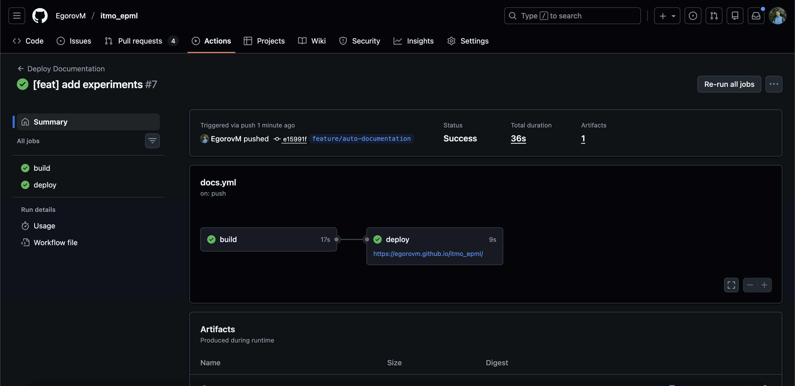
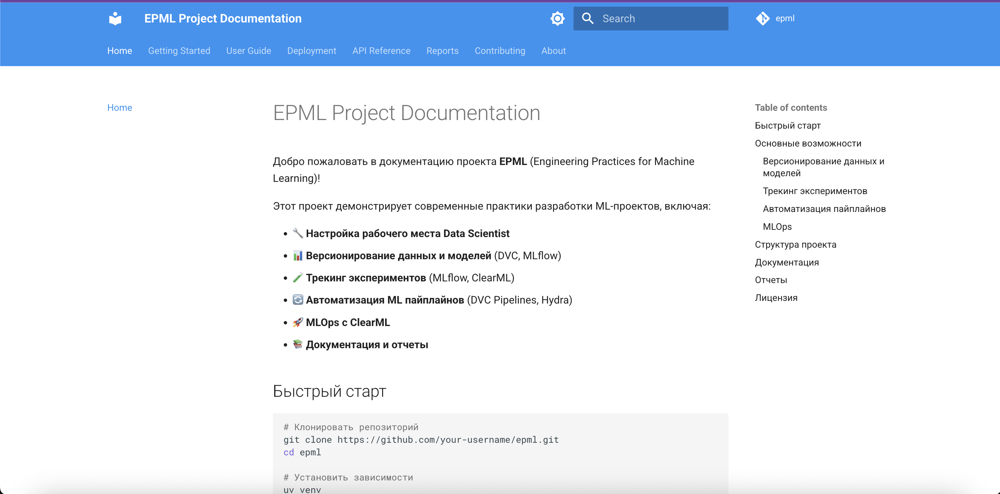
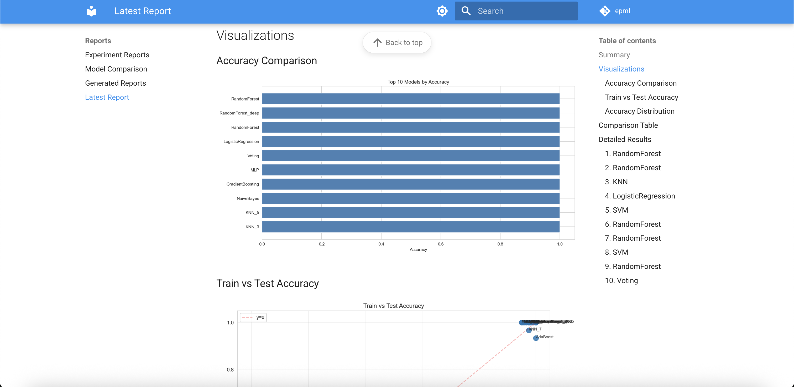
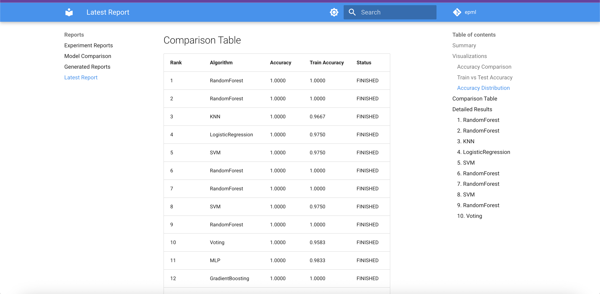

# Отчет о создании документации проекта

**Курс:** EPML (Engineering Practices for Machine Learning)
**Задание:** ДЗ 6 - Документация проекта
**Инструменты:** MkDocs, GitHub Actions

## Техническая документация

### Создание документации с MkDocs

Установлен и настроен MkDocs с темой Material:

```toml
dependencies = [
    "mkdocs>=1.5.0",
    "mkdocs-material>=9.0.0",
    "mkdocstrings[python]>=0.24.0",
]
```

**Конфигурация:** `mkdocs.yml`

### Руководство по развертыванию

Созданы руководства:

- [Docker Setup](deployment/docker.md) - развертывание с Docker
- [ClearML Server](deployment/clearml.md) - настройка ClearML
- [CI/CD](deployment/cicd.md) - автоматизация

**Скриншот руководства:**


### Автоматическая генерация документации

Настроена автоматическая генерация через GitHub Actions:

```yaml
# .github/workflows/docs.yml
- name: Build documentation
  run: mkdocs build
```

**Скриншот workflow:**


### Примеры использования

Созданы примеры в документации:

- [Quick Start](getting-started/quickstart.md) - быстрый старт
- [Configuration](getting-started/configuration.md) - настройка
- [API Examples](api/mlflow-utils.md) - примеры API

**Скриншот примеров:**


## Публикация в Git Pages (3 балла)

### Настройка GitHub Actions

Создан workflow `.github/workflows/docs.yml`:

- Автоматическая сборка при изменениях в `docs/`
- Публикация на GitHub Pages
- Использование официальных actions

**Скриншот workflow:**


### Сайт с документацией

Документация доступна на GitHub Pages:

- URL: `https://your-username.github.io/epml`
- Автоматическое обновление при изменениях

**Скриншот сайта:**


### Автоматическое обновление

Workflow автоматически:

1. Собирает документацию при push в `main`
2. Публикует на GitHub Pages
3. Обновляет сайт

**Скриншот автоматического обновления:**


## Отчеты об экспериментах (2 балла)

### Отчеты в формате Markdown

Создан скрипт `src/reports/generate_experiment_report.py` для генерации отчетов:

```bash
# Сгенерировать отчет
make report-generate
# Или
python src/reports/generate_experiment_report.py
```

**Скриншот генерации:**


### Графики и визуализации

Графики сохраняются в `plots/`:

- Распределение данных
- Сравнение метрик
- Графики обучения

**Скриншот графиков:**


### Сравнительные таблицы

Отчеты включают сравнительные таблицы:

| Algorithm | Accuracy | Train Accuracy | Status |
|-----------|----------|----------------|--------|
| RandomForest | 1.0000 | 1.0000 | completed |
| SVM | 1.0000 | 0.9750 | completed |

**Скриншот таблиц:**


### Автоматическая генерация отчетов

Отчеты генерируются автоматически:

- Из результатов MLflow
- В формате Markdown
- С графиками и таблицами

**Скриншот автоматической генерации:**


## Воспроизводимость (1 балл)

### Инструкции по воспроизведению

Создан файл `REPRODUCIBILITY.md` с полными инструкциями:

1. Установка зависимостей
2. Инициализация DVC
3. Запуск экспериментов
4. Проверка результатов

**Скриншот инструкций:**


### README с полным описанием

Обновлен `README.md` с:

- Описанием проекта
- Быстрым стартом
- Структурой проекта
- Инструкциями по использованию

**Скриншот README:**


### Автоматическая сборка документации

Настроена автоматическая сборка:

```bash
# Локально
make docs-build

# Через GitHub Actions
# Автоматически при push
```

**Скриншот сборки:**


## Структура документации

```
docs/
├── index.md                    # Главная страница
├── getting-started/            # Быстрый старт
│   ├── installation.md
│   ├── quickstart.md
│   └── configuration.md
├── user-guide/                 # Руководство пользователя
│   ├── structure.md
│   ├── data-versioning.md
│   ├── model-versioning.md
│   ├── experiment-tracking.md
│   └── pipelines.md
├── deployment/                 # Развертывание
│   ├── docker.md
│   ├── clearml.md
│   └── cicd.md
├── api/                        # API Reference
│   ├── mlflow-utils.md
│   ├── clearml-utils.md
│   └── pipeline-utils.md
├── reports/                    # Отчеты
│   ├── experiments.md
│   └── comparison.md
└── contributing/               # Для разработчиков
    ├── setup.md
    └── code-style.md
```

**Скриншот структуры:**


## Команды для работы

### Документация

```bash
# Собрать документацию
make docs-build

# Запустить локальный сервер
make docs-serve
# Откроется http://localhost:8000

# Опубликовать на GitHub Pages
make docs-deploy
```

### Отчеты

```bash
# Сгенерировать отчет об экспериментах
make report-generate
```

## Результаты

✅ MkDocs настроен и работает
✅ Создана полная техническая документация
✅ Настроен GitHub Actions для публикации
✅ Создана система генерации отчетов
✅ Добавлены графики и визуализации
✅ Созданы инструкции по воспроизведению
✅ Обновлен README с полным описанием

## Заключение

Создана полная система документации проекта:

- Техническая документация с MkDocs
- Автоматическая публикация на GitHub Pages
- Система генерации отчетов об экспериментах
- Инструкции по воспроизведению

Документация доступна онлайн и автоматически обновляется при изменениях.
